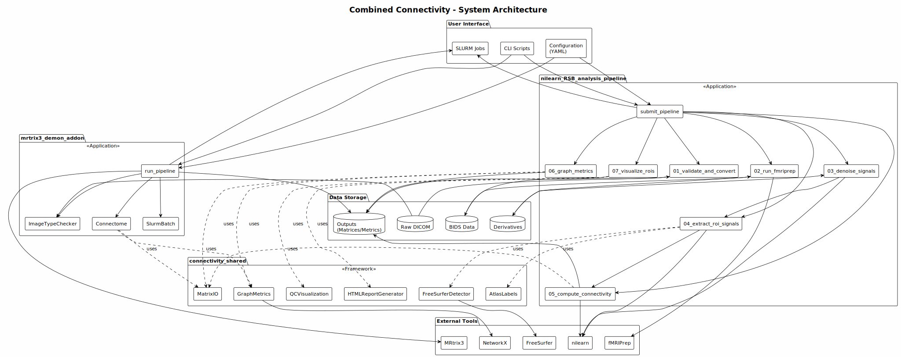
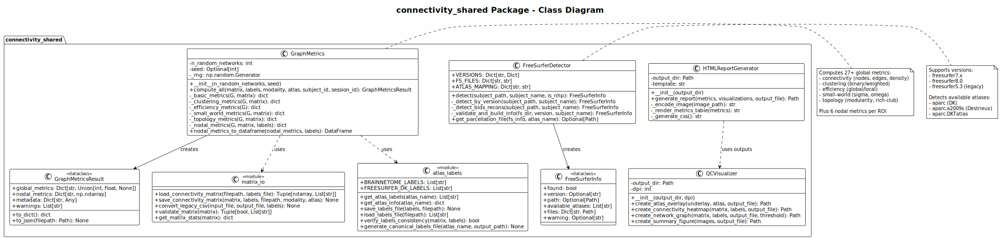
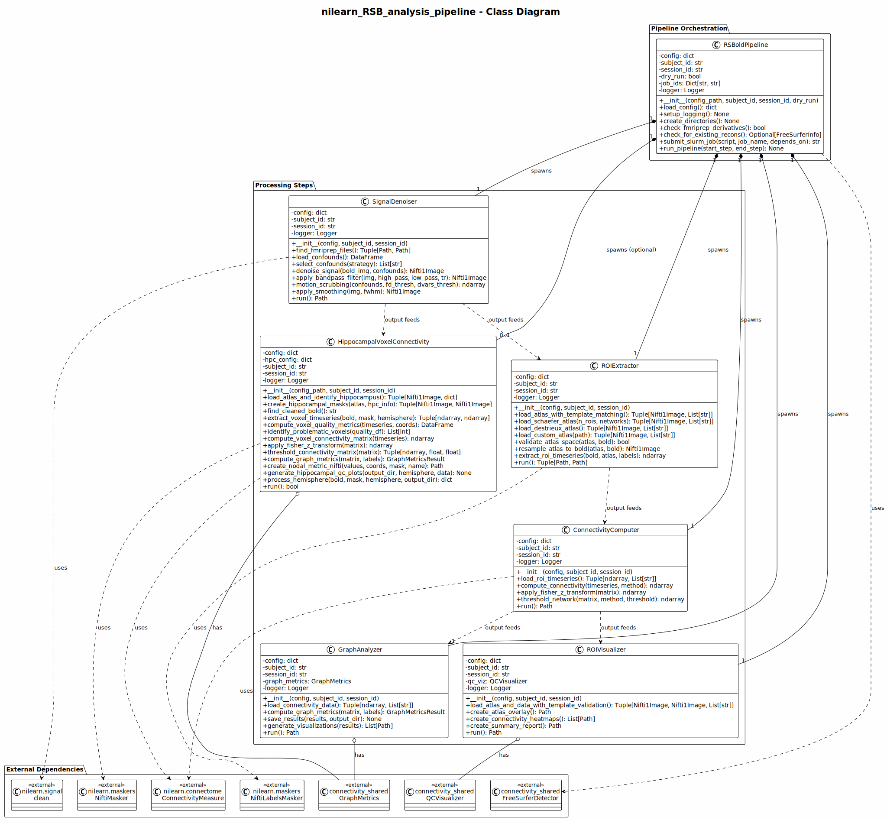
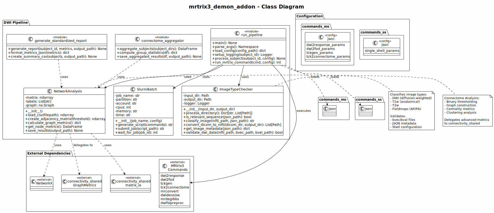
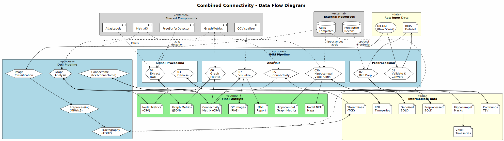
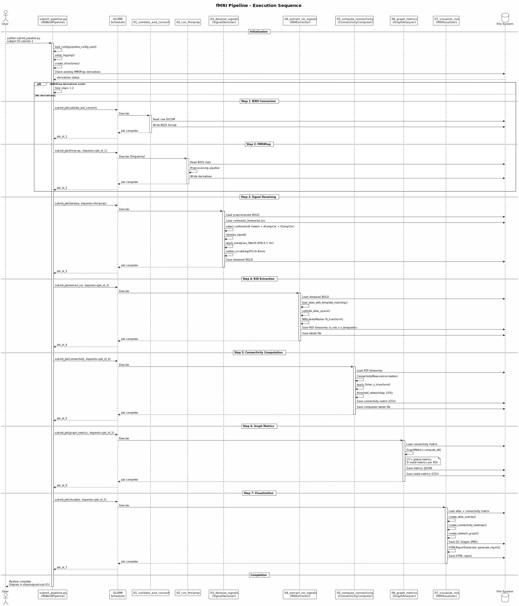
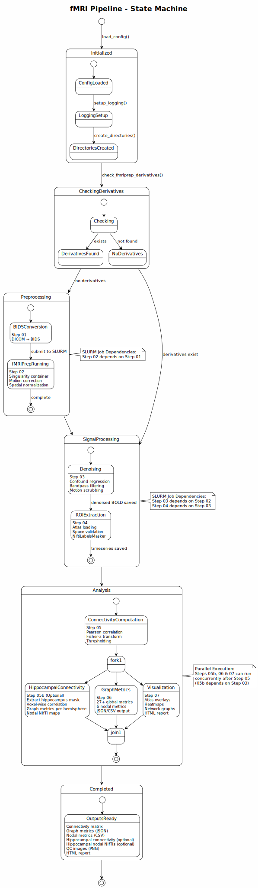
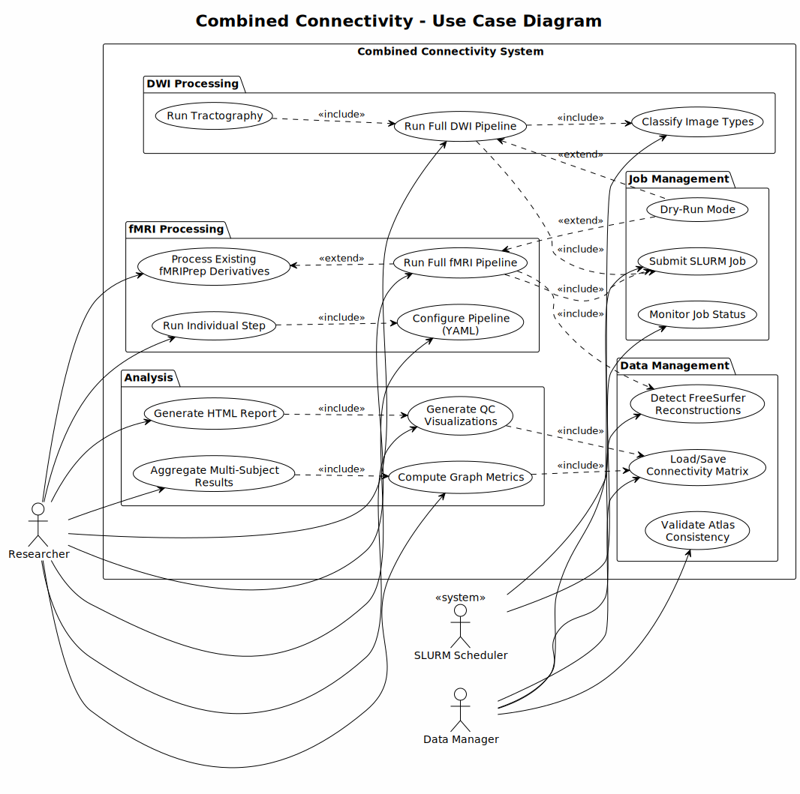

# Combined Connectivity - Architecture Overview

This document provides a comprehensive architectural overview of the Combined Connectivity system, which processes both functional (fMRI) and structural (DWI) neuroimaging data to generate brain connectivity matrices and graph theory metrics.

## System Overview

The Combined Connectivity system consists of three main components:

1. **connectivity_shared** - A reusable Python package providing core utilities
2. **nilearn_RSB_analysis_pipeline** - Resting-state BOLD fMRI processing pipeline
3. **mrtrix3_demon_addon** - Diffusion-weighted imaging (DWI) pipeline

### Architecture Diagram



## Component Details

### connectivity_shared Package

The shared package provides core functionality used by both pipelines:

| Module | Purpose |
|--------|---------|
| `GraphMetrics` | Compute 27+ global and 6 nodal graph theory metrics |
| `matrix_io` | Standardized connectivity matrix I/O operations |
| `FreeSurferDetector` | Detect and validate FreeSurfer reconstructions |
| `atlas_labels` | Canonical atlas label definitions (Brainnetome, DK) |
| `QCVisualizer` | Generate quality control visualizations |
| `HTMLReportGenerator` | Create comprehensive HTML reports |



### fMRI Pipeline Architecture

The fMRI pipeline follows a sequential 7-step processing flow:

| Step | Class | Description |
|------|-------|-------------|
| 01 | - | BIDS validation and DICOM conversion |
| 02 | - | fMRIPrep preprocessing (Singularity) |
| 03 | `SignalDenoiser` | Confound regression, filtering, scrubbing |
| 04 | `ROIExtractor` | Atlas-based ROI time series extraction |
| 05 | `ConnectivityComputer` | Correlation matrix computation |
| 06 | `GraphAnalyzer` | Graph theory metric computation |
| 07 | `ROIVisualizer` | QC visualization generation |

The `RSBoldPipeline` class orchestrates all steps via SLURM job submission.



### DWI Pipeline Architecture

The DWI pipeline processes diffusion data through MRtrix3:

| Component | Purpose |
|-----------|---------|
| `ImageTypeChecker` | Classify DICOM/NIfTI image types |
| `run_pipeline` | Main orchestrator for MRtrix3 commands |
| `NetworkAnalysis` | Graph metrics for structural connectivity |
| `SlurmBatch` | SLURM job script generation |



## Data Flow

Data flows through the system in a well-defined sequence:

### fMRI Data Flow

```
Raw DICOM → BIDS → fMRIPrep → Denoised BOLD → ROI Timeseries →
Connectivity Matrix → Graph Metrics → QC Report
```

### DWI Data Flow

```
Raw DICOM → NIfTI → Preprocessing → Tractography →
Connectome → Graph Metrics → Report
```



## Execution Sequence

The fMRI pipeline execution follows strict dependencies managed by SLURM:



## Pipeline State Machine

The pipeline transitions through well-defined states:



## Use Cases

The system supports multiple use cases for researchers and data managers:



## Design Patterns

The codebase employs several design patterns:

### 1. Service/Processor Pattern
Each processing step is implemented as a standalone class with consistent interface:
- `load_config()` - Configuration loading
- `setup_logging()` - Logging initialization
- `run()` / `execute()` - Main processing logic

### 2. Factory Pattern
Atlas loading uses factory methods to instantiate appropriate atlas handlers:
```python
ROIExtractor.load_atlas_with_template_matching()
atlas_labels.get_atlas_labels(atlas_name)
```

### 3. Strategy Pattern
Processing strategies are configurable:
- Connectivity method: correlation, partial correlation
- Thresholding: proportional, absolute, adaptive
- Atlas selection: Schaefer, Destrieux, custom

### 4. Data Class Pattern
Immutable data containers for results:
- `FreeSurferInfo` - FreeSurfer detection results
- `GraphMetricsResult` - Graph theory computation results

### 5. Adapter Pattern
Legacy format conversion:
- `convert_legacy_csv()` - Harmonize old tck2connectome output to standardized format

## Configuration

All pipelines are YAML-driven with variable expansion:

```yaml
template:
  output_space: "MNI152NLin2009cAsym"
  resolution: "res-2"

paths:
  project_root: "/path/to/project"
  derivatives: "{project_root}/data/derivatives"

atlas:
  name: "schaefer_2018"
  n_rois: 400
```

## Graph Theory Metrics

Both pipelines compute comprehensive graph theory metrics:

### Global Metrics (27+)
- **Connectivity**: nodes, edges, density, sparsity
- **Weights**: total weight, mean/std edge weight
- **Degree**: mean/std/max degree and strength
- **Clustering**: binary and weighted clustering coefficient
- **Efficiency**: global efficiency, local efficiency, path length
- **Small-world**: small-worldness (sigma, omega), normalized clustering/path
- **Topology**: assortativity, modularity, communities, rich-club

### Nodal Metrics (6 per ROI)
- Degree, Strength
- Clustering coefficient
- Betweenness centrality
- Local efficiency
- ROI labels

## Supported Atlases

| Atlas | ROIs | Pipeline Support |
|-------|------|-----------------|
| Brainnetome | 246 | Both (template-based) |
| Schaefer 2018 | 100-1000 | fMRI only |
| FreeSurfer DK | 84 | Both (requires recon) |
| FreeSurfer Destrieux | 164 | Both (requires recon) |
| AAL/AAL3 | 116/152 | fMRI (via nilearn) |
| Custom | Variable | Both (user-provided) |

## Technology Stack

| Layer | Technologies |
|-------|-------------|
| **Neuroimaging** | nilearn, nibabel, fMRIPrep, MRtrix3 |
| **Graph Theory** | NetworkX, Brain Connectivity Toolbox |
| **Data Processing** | NumPy, Pandas, SciPy |
| **Visualization** | Matplotlib, Seaborn |
| **HPC** | SLURM, Singularity |
| **Configuration** | YAML, JSON |

## File Format Standards

| Format | Description | Tool |
|--------|-------------|------|
| CSV | Connectivity matrix with headers | `load_connectivity_matrix()` |
| NPY | NumPy binary array | `load_connectivity_matrix()` |
| JSON | Graph metrics | `GraphMetricsResult.to_json()` |
| HTML | QC reports | `HTMLReportGenerator.generate()` |
| TXT | ROI labels (one per line) | `load_labels_file()` |

## Quality Control

Multi-level QC is implemented throughout:

1. **Data Validation**: BIDS structure, image dimensions, metadata
2. **Motion Assessment**: FD thresholds, DVARS percentiles
3. **Signal QC**: Temporal variance, frequency content
4. **Connectivity QC**: Matrix statistics, edge distributions
5. **Visualization**: Heatmaps, network graphs, atlas overlays

## Deployment

### Local Development
```bash
pip install -e ./connectivity_shared
python scripts/03_denoise_signals.py --subject 01
```

### HPC Production
```bash
python scripts/submit_pipeline.py --subject 01 --session 1 --config configs/pipeline_config.yaml
```

### Dry-Run Testing
```bash
python scripts/submit_pipeline.py --subject 01 --dry-run
```

## Related Documentation

- [Usage Guide](usage_guide.md) - Detailed usage instructions
- [Version Control Guide](version_control_guide.md) - Git workflow and versioning
- [Methods Summary](../nilearn_RSB_analysis_pipeline/METHODS.md) - Scientific methods description
